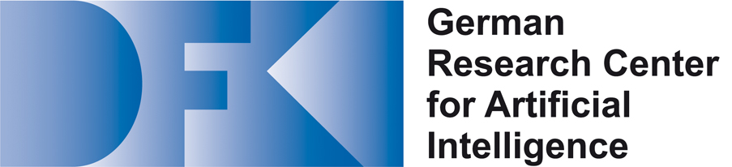

MetaDL is a project funded by the German Federal Ministry of Education and Research (BMBF) through a [directive for funding](https://www.bmbf.de/foerderungen/bekanntmachung-2428.html) in the field of "Artificial Intelligence".
As part of the MetaDL project, we want to generate code for AI applications on a variety of accelerator-based systems based on the [AnyDSL framework](https://anydsl.github.io).
Particularly interesting are systems with special instructions for deep learning such as the tensor cores on NVIDIA graphics processors (GPUs) or dedicated AI hardware such as Google's Tensor Processing Units (TPUs).
The usefulness of the concepts developed is demonstrated by applications in bioinformatics (analysis of DNA sequences) and image synthesis (noise suppression).

## Project Partners

{: style="width:150px"}

Among other research projects, the [Compiler Design Lab](https://compilers.cs.uni-saarland.de) at Saarland University develops the AnyDSL framework including the Impala programming language, the Thorin intermediate language, their type systems and compiler.

{: style="width:200px"}

The research department [Agents and Simulated Reality](https://www.dfki.de/web/forschung/forschungsbereiche-gruppen/agenten-und-simulierte-realitaet) at the German Research Center for Artificial Intelligence (DFKI) develops the AnyDSL framework with focus on acceleration of rendering applications using ray tracing and global illumination on multi-core CPUs, GPUs, and FPGAs.

### [JGU Mainz, Scientific Computing and Bioinformatics](https://www.bio.informatik.uni-mainz.de)

### [JGU Mainz, High Performance Computing](https://www.hpc.informatik.uni-mainz.de)
